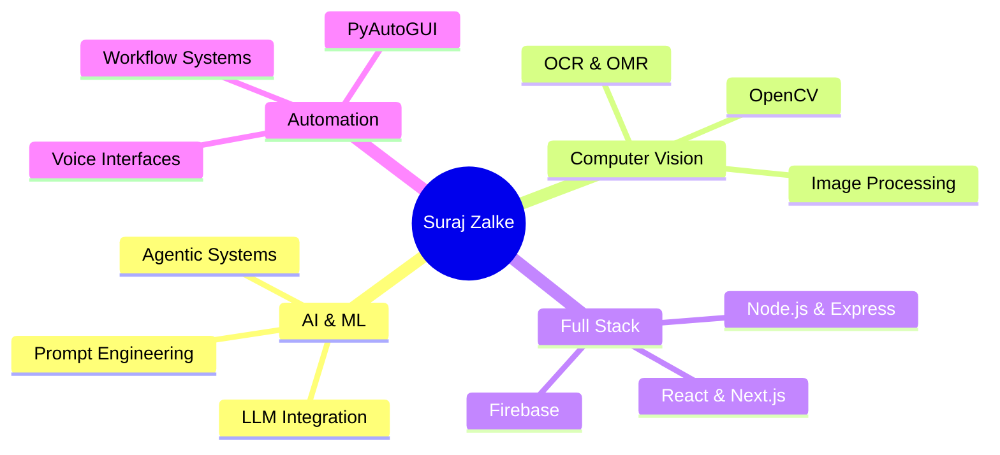

<div align="center">


<a href="https://git.io/typing-svg">
  
</a>

<p>
  <a href="https://suraj-zalke-protfolio.netlify.app/"></a>
  <a href="https://linkedin.com/in/suraj-zalke-15a28324d"></a>
  <a href="mailto:surajzalke724@gmail.com"></a>
  <a href="https://github.com/SurajZalke"></a>
</p>

<p>
  
  
  
</p>

</div>


## 👨‍💻 About Me

<div align="center">

```javascript
const developer = {
  name: "Suraj Zalke",
  role: "AI Developer & Software Engineer",
  education: "B.E. Computer Science Engineering (pursuing)",
  location: "🇮🇳 Maharashtra, India",

  focus: ["Agentic AI", "Computer Vision", "Full-Stack Web"],
  languages: ["Python", "JavaScript", "TypeScript"],

  currentlyBuilding: "SK AI Assistant (voice + agentic planning)",
  learning: "Advanced Agentic AI Architecture",
  openTo: "Internships, Collaboration, Open Source"
};
```

</div>

### 💡 What I Build

<div align="center">


**AI Systems**
<br/><sub>Agentic AI · LLM integration · Prompt engineering</sub>

<br/>


**Computer Vision**
<br/><sub>OpenCV · OCR · OMR · Image processing</sub>

<br/>


**Full-Stack Web**
<br/><sub>React · Next.js · Node.js · TypeScript · Firebase</sub>

<br/>


**Voice Systems**
<br/><sub>Speech recognition · NLP · Voice interfaces</sub>

<br/>


**Automation**
<br/><sub>PyAutoGUI · Workflows · System integration</sub>

</div>

### 🌟 My Specialization

<div align="center">



</div>

### 🎯 System Building Philosophy

<div align="center">

```text
┌─────────────────────────────────────────────────────────────┐
│                                                             │
│   INPUT → UNDERSTAND → REASON → PLAN → ACT → VERIFY         │
│                                                             │
│   "A system should not just perform an action.              │
│    It should understand what it's doing and verify          │
│    whether it actually succeeded."                          │
│                                                             │
└─────────────────────────────────────────────────────────────┘
```

</div>

### 📚 Currently

<div align="center">

**🔭 Working On**
```yaml
- SK AI Assistant
- Computer Vision Tools
- Educational Platforms
- Automation Systems
```

**🌱 Learning**
```yaml
- Advanced Agentic AI
- System Architecture
- Real-time Processing
- Cloud Infrastructure
```

**🤝 Open To**
```yaml
- Internship Roles
- Collaboration
- Open Source
- Freelance Projects
```

</div>


## 🛠️ Technical Skills

<div align="center">

### AI & Machine Learning

<br/>


### Computer Vision


### Languages


### Frontend


### Backend & Databases


### Automation


### Tools & Deployment


</div>

<!-- NOTE: I removed icons for C, C++, Java, Flask, FastAPI, MongoDB, MySQL, SQLite, Figma, Android Studio, Heroku, Bootstrap, Material UI
     because none of them show up in your repos. Add any back that you have really used in a project. -->


## 🚀 Featured Projects

<div align="center">

### 🤖 SK AI Assistant


Voice-controlled AI assistant with agentic planning and tool orchestration (in private development; demo available on request).

```text
Voice/Text → Intent → SK Brain → Agentic Planner → Tool Orchestration → Verify → Response
```

🎙️ Voice Control • 🧠 Agentic Planning • 🛠️ Tool Orchestration • ✅ Auto-Verification • 💾 Context Memory • 👁️ Vision • 🔒 Safety Layer

`Python` `Speech Recognition` `LLM APIs` `PyAutoGUI` `OpenCV`

---

### 🎓 AI Educational Platform


Quiz platform for JEE / NEET / CBSE practice with AI-generated MCQs, real-time scoring, and live leaderboards.

📚 AI Quiz Generation • ⏱️ Real-time Scoring • 🏆 Leaderboards • 📊 Analytics Dashboard • 📱 Mobile Responsive

`React` `Next.js` `Firebase` `AI APIs` `Real-time DB`

---

### 👁️ Computer Vision OMR Scanner


Optical mark recognition system that reads scanned answer sheets and produces results in batches.

```text
Scan → Detect Bubbles → Extract Answers → Batch Process → Verify → Report
```

📄 Bubble Detection • 🔍 OpenCV Pipeline • 📊 Batch Processing • 🎯 Quality-Adaptive

`Python` `OpenCV` `RapidOCR` `Image Processing`

---

### 🎓 MSP College Advance

[](https://github.com/SurajZalke/mspcollage-manora)


Progressive Web App for college students with academic resources, live updates, and an admission portal.

📚 Academic Hub • 📢 Live Updates • 📴 Offline-First PWA • 🔔 Push Notifications • 📱 Mobile Optimized

`HTML5` `CSS3` `JavaScript` `Firebase` `Service Workers`

---

### 🌐 Interactive Portfolio

[](https://suraj-zalke-protfolio.netlify.app/)

Personal portfolio with 3D elements, interactive sections, and smooth transitions.

`React` `Three.js` `CSS Animations`

---

### 🏫 PCCOER Portal

[](https://github.com/SurajZalke/pccoer-portal)

Educational portal with AI integration for student information and course management.

`TypeScript` `React` `REST APIs`

---

### 💬 WhatsApp Automation

[](https://github.com/SurajZalke/whatapp-automation)

Automated messaging with bulk operations, scheduling, and contact management.

`JavaScript` `Node.js` `Automation`

<br/>

**<a href="https://github.com/SurajZalke?tab=repositories">🔗 Explore All Projects on GitHub →</a>**

</div>

<!-- TIP: for each project above, add a real number or a link when you have one, e.g. "used by 120 students at MSP College".
     A real small number is more believable than "1000s". -->


## 📊 GitHub Analytics

<div align="center">


</div>

<!-- I removed the hand-typed "Verified Live Stats" table, the "Achievements" cards and the "Context for Recruiters" note.
     The live cards above already show your real numbers, and typed-in numbers can go out of date or look unverified. -->


## 🏆 Certifications & Events

<div align="center">

### 🎓 Certifications

📜 **Certified Cyber Defense Expert (CCDE)**
<br/>🏢 CCDE Institute · 📅 April 24, 2025
<br/><sub>Cybersecurity, defensive protocols, security implementation</sub>

📜 **Cybersecurity Assessment Certificate**
<br/>🏢 LearnTube · 📅 April 27, 2026
<br/><sub>Security evaluation</sub>

📜 **AI Fundamentals**
<br/>🏢 Coursera (Google) · 📅 2025
<br/><sub>Machine learning and AI applications</sub>

### 🎯 Events

🎪 **The Agentic Shift** · GDGoC PCCOE&R · 1 Oct 2026
<br/>🎪 **Let's Git it** · GDGoC PCCOE&R · 30 Sep 2026

<br/>

<details open>
<summary><b>📸 Certificate Gallery (click to collapse)</b></summary>

<br/>

**🔐 CCDE Cybersecurity Expert** · *April 2025*
<br/>

<br/>

**🤖 Google AI Fundamentals** · *2025*
<br/>

<br/>

**⚡ The Agentic Shift** · *Oct 1, 2026*
<br/>

<br/>

**🔧 Let's Git it** · *Sep 30, 2026*
<br/>

</details>

</div>

<!-- NOTE: the CCDE credential ID started with "PREVIEW", so I removed it from the page. Add a real verification link here if you have one. -->


## 🎓 Education

<div align="center">

### Computer Science Engineering

*Currently pursuing*

Focus areas: Artificial Intelligence & Machine Learning · Computer Vision & Image Processing · Automation Systems · System Design

</div>


## 🐍 Contribution Activity

<div align="center">

<picture>
  <source media="(prefers-color-scheme: dark)" srcset="https://raw.githubusercontent.com/SurajZalke/SurajZalke/output/github-contribution-grid-snake-dark.svg">
  <source media="(prefers-color-scheme: light)" srcset="https://raw.githubusercontent.com/SurajZalke/SurajZalke/output/github-contribution-grid-snake.svg">
  
</picture>

</div>


## 💼 Let's Connect!

<div align="center">

### 🌟 Open to Opportunities


<br/><br/>

<a href="https://suraj-zalke-protfolio.netlify.app/"></a>
<a href="https://linkedin.com/in/suraj-zalke-15a28324d"></a>
<a href="mailto:surajzalke724@gmail.com"></a>
<a href="https://github.com/SurajZalke"></a>

<br/><br/>

### ⭐ Show Some Love

If you like my work, consider giving a ⭐ to my repositories!


<br/><br/>


</div>


<p align="center">
<b>💫 "I build systems that understand, decide, and verify." 💫</b>
</p>
