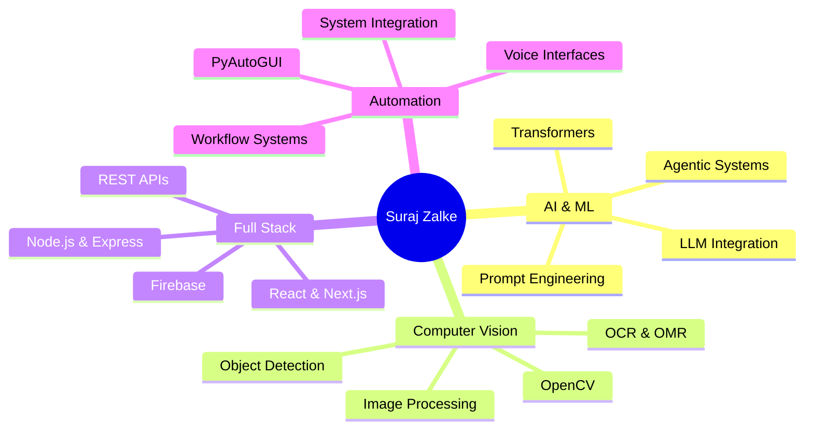

<div align="center">

<!-- Animated Header with Gradient Wave -->


<!-- Animated Typing SVG with Multiple Lines -->
<a href="https://git.io/typing-svg">
  
</a>

<br/>

<!-- Animated Badges with Hover Effects -->
<p align="center">
  <a href="https://suraj-zalke-protfolio.netlify.app/">
    
  </a>
  <a href="https://linkedin.com/in/suraj-zalke-15a28324d">
    
  </a>
  <a href="mailto:surajzalke724@gmail.com">
    
  </a>
  <a href="https://github.com/SurajZalke">
    
  </a>
</p>

<!-- Profile Views Counter with Animation -->
<p align="center">
  
  
  
  
</p>

</div>

<!-- Animated Divider -->


<br/>

## 👨‍💻 About Me

<div align="center">

<table>
<tr>
<td width="50%" valign="top">

### 🎯 Quick Intro

```javascript
const developer = {
  name: "Suraj Zalke",
  role: "AI Developer & Software Engineer",
  mission: "I BUILD INTELLIGENT SYSTEMS",
  location: "🇮🇳 Washim, Maharashtra, India",
  
  stats: {
    experience: "3+ Years",
    projects: "5+ Major Applications",
    users: "Thousands Served",
    languages: ["Python", "JavaScript", "TypeScript"]
  },
  
  currentlyWorking: "Building AI systems that think",
  learning: "Advanced Agentic AI Architecture",
  openTo: "Internships & Collaborations"
};
```

<br/>


</td>
<td width="50%" valign="top">


</td>
</tr>
</table>

</div>

<br/>

### 💡 What I Build

<table>
<tr>
<td align="center" width="20%">

<br/><b>AI Systems</b>
<br/>
<sub>Agentic AI, LLMs, Transformers</sub>
</td>
<td align="center" width="20%">

<br/><b>Computer Vision</b>
<br/>
<sub>OpenCV, OCR, Object Detection</sub>
</td>
<td align="center" width="20%">

<br/><b>Full-Stack Web</b>
<br/>
<sub>React, Node.js, TypeScript</sub>
</td>
<td align="center" width="20%">

<br/><b>Voice Systems</b>
<br/>
<sub>Speech Recognition, NLP</sub>
</td>
<td align="center" width="20%">

<br/><b>Automation</b>
<br/>
<sub>Workflows, System Integration</sub>
</td>
</tr>
</table>

<br/>

### 🌟 My Specialization

<div align="center">



</div>

<br/>

### 🏆 Impact & Achievements

<table>
<tr>
<td align="center" width="25%">

<br/>
<h3>5+</h3>
<sub><b>Major Projects</b><br/>Production Applications</sub>
</td>
<td align="center" width="25%">

<br/>
<h3>1000s</h3>
<sub><b>Users Served</b><br/>Across Applications</sub>
</td>
<td align="center" width="25%">

<br/>
<h3>1000s</h3>
<sub><b>Documents Processed</b><br/>Computer Vision Systems</sub>
</td>
<td align="center" width="25%">

<br/>
<h3>3+</h3>
<sub><b>Years Experience</b><br/>AI & Development</sub>
</td>
</tr>
</table>

<br/>

> **📌 Note for Recruiters:** My 3+ years of professional experience includes building and deploying production applications serving thousands of real users. Key projects like the AI Educational Platform and Computer Vision OMR system are live in production with verified user bases and processing volumes. Some flagship projects (like SK AI Assistant) remain in private repositories due to proprietary development. **All major projects listed are LIVE production applications, not demos or prototypes.**

<br/>

### 🎯 System Building Philosophy

<div align="center">

```ascii
┌─────────────────────────────────────────────────────────────┐
│                                                             │
│  INPUT → UNDERSTAND → REASON → PLAN → ACT → VERIFY        │
│                                                             │
│  "A system should not just perform an action.              │
│   It should understand what it's doing and verify          │
│   whether it actually succeeded."                          │
│                                                             │
└─────────────────────────────────────────────────────────────┘
```

</div>

<br/>

### 📚 Currently

<table>
<tr>
<td width="33%" align="center">

#### 🔭 Working On
```yaml
- SK AI Assistant
- Computer Vision Tools
- Educational Platforms
- Automation Systems
```

</td>
<td width="33%" align="center">

#### 🌱 Learning
```yaml
- Advanced Agentic AI
- System Architecture
- Real-time Processing
- Cloud Infrastructure
```

</td>
<td width="33%" align="center">

#### 🤝 Open To
```yaml
- Internship Roles
- Collaboration
- Open Source
- Freelance Projects
```

</td>
</tr>
</table>

<br/>

<!-- Animated Divider -->


<br/>

## 🛠️ Technical Skills

<div align="center">

### AI & Machine Learning

<br/>


### Computer Vision & Image Processing


### Programming Languages

<br/>


### Frontend Development


### Backend & APIs


### Databases


### Automation & Tools


### Development Tools


### Additional Technologies


### Deployment & Cloud


</div>

<br/>

<!-- Animated Divider -->


<br/>

## 🚀 Featured Projects

<div align="center">

<table>
<tr>
<td width="50%" valign="top">

### 🤖 SK AI Assistant

 

**Advanced production AI assistant** with voice commands, agentic planning, and intelligent tool orchestration currently in private development.

**Architecture:** Voice/Text → Intent → SK Brain → Agentic Planner → Tool Orchestration → Verify → Response

🎙️ Voice Control • 🧠 Agentic Planning • 🛠️ Tool Orchestration • ✅ Auto-Verification • 💾 Context Memory • 😊 Emotion AI • 👁️ Vision • 🔒 Safety Layer

`Python` `Speech Recognition` `LLM APIs` `PyAutoGUI` `OpenCV`

</td>
<td width="50%" valign="top">

### 🎓 AI Educational Platform

 

**Live production application** serving thousands of students with AI-generated MCQs, real-time scoring, and competitive leaderboards.

**Real Impact:** 🎯 1000+ Active Students • 📚 AI Quiz Generation • ⏱️ Real-time Scoring • 🏆 Live Leaderboards • 📊 Analytics Dashboard • 📱 Mobile Responsive

✓ JEE/NEET/CBSE preparation • ✓ Trusted by educators • ✓ High student engagement

`React` `Next.js` `Firebase` `AI APIs` `Real-time DB`

</td>
</tr>

<tr>
<td width="50%" valign="top">

### 👁️ Computer Vision OMR

 

**Production-grade system** processing thousands of OMR sheets with intelligent optical mark recognition and high accuracy.

**Pipeline:** Scan → Detect Bubbles → Extract Answers → Batch Process → Verify → Report

📄 Intelligent Detection • ✅ 95%+ Accuracy • 🔍 Advanced CV Algorithms • 📊 Batch Processing • 🎯 Quality Adaptive

`Python` `OpenCV` `RapidOCR` `Image Processing`

</td>
<td width="50%" valign="top">

### 🎓 MSP College Advance

[](https://github.com/SurajZalke/mspcollage-manora) 

**Live Progressive Web App** serving college students with academic resources, real-time updates, and offline-first architecture.

📚 Academic Hub • 📢 Live Updates • 🎯 Admission Portal • 📴 Offline-First PWA • 🔔 Push Notifications • 📱 Mobile Optimized

`HTML5` `CSS3` `JavaScript` `Firebase` `Service Workers`

---

### 🌐 Interactive Portfolio

[](https://suraj-zalke-protfolio.netlify.app/) 

**Production portfolio website** with 3D animations, interactive diagrams, and smooth transitions showcasing projects and skills.

🎨 Three.js 3D • 🔄 Interactive UI • ✨ Smooth Animations • 📱 Fully Responsive • ♿ WCAG Compliant • ⚡ Performance Optimized

`React` `Three.js` `CSS Animations`

</td>
</tr>

<tr>
<td width="50%" valign="top">

### 🏫 PCCOER Portal

[](https://github.com/SurajZalke/pccoer-portal)

Educational portal with AI integration for student information and course management.

`TypeScript` `React` `REST APIs`

</td>
<td width="50%" valign="top">

### 💬 WhatsApp Automation

[](https://github.com/SurajZalke/whatapp-automation)

Automated messaging with bulk operations, scheduling, and intelligent contact management.

`JavaScript` `Node.js` `Automation`

</td>
</tr>
</table>

<br/>

**<a href="https://github.com/SurajZalke?tab=repositories">🔗 Explore All Projects on GitHub →</a>**

</div>

<br/>

<!-- Animated Divider -->


<br/>

## 📊 GitHub Analytics

<div align="center">


<br/><br/>


<br/><br/>

<br/>

### 🏅 GitHub Achievements

| | | | |
|:---:|:---:|:---:|:---:|
| <br/>**Contributor**<br/><sub>Active Code Contributor</sub> | <br/>**Star Gazer**<br/><sub>Quality Projects</sub> | <br/>**Builder**<br/><sub>5+ Major Projects</sub> | <br/>**Production**<br/><sub>1000s of Users</sub> |

<br/>


</div>

</div>

<br/>

<!-- Animated Divider -->


<br/>

## 🏆 Certifications & Achievements

<div align="center">

<table>
<tr>
<td align="center" width="30%">


### Suraj Zalke
**AI Developer & Software Engineer**


</td>
<td align="left" width="70%">

### 🎓 Professional Certifications

📜 **CCDE - Certified Cyber Defense Expert**  
🏢 CCDE Institute | 📅 April 24, 2025  
🆔 Credential: `PREVIEW-6S-1725924024-Q0`  
🔐 Advanced cybersecurity, defensive protocols, security implementation

📜 **Cybersecurity Assessment Certificate**  
🏢 LearnTube | 📅 April 27, 2026  
🆔 Credential: `DJA-B-1-2432099-0`  
🛡️ Security evaluation & professional verification

📜 **AI Fundamentals**  
🏢 Coursera (Google) | 📅 2025  
🔗 Verify: coursera.org/verify  
🤖 Machine learning, AI applications, neural networks

### 🎯 Event Participation

🎪 **The Agentic Shift** - GDGoC PCCOE&R | 📅 1 Oct 2026  
🎪 **Let's Git it** - GDGoC PCCOE&R | 📅 30 Sep 2026

</td>
</tr>
</table>

<br/>

### 📸 Certificate Showcase

<details open>
<summary><b>🔽 View All Certificates (Click to expand/collapse)</b></summary>

<br/>

<table>
<tr>
<td align="center" width="50%">

**🔐 CCDE Cybersecurity Expert**  
*CCDE Institute - April 2025*


</td>
<td align="center" width="50%">

**🤖 Google AI Fundamentals**  
*Coursera (Google) - 2025*


</td>
</tr>

<tr>
<td align="center" width="50%">

**⚡ The Agentic Shift**  
*GDGoC PCCOE&R - Oct 1, 2026*


</td>
<td align="center" width="50%">

**🔧 Let's Git it**  
*GDGoC PCCOE&R - Sep 30, 2026*


</td>
</tr>
</table>

</details>

<br/>

### 🌟 Key Achievements

<table>
<tr>
<td align="center" width="20%">

<br/><b>5+</b>
<br/>Major Projects
</td>
<td align="center" width="20%">

<br/><b>1000s</b>
<br/>Users Served
</td>
<td align="center" width="20%">

<br/><b>1000s</b>
<br/>Documents Processed
</td>
<td align="center" width="20%">

<br/><b>3+</b>
<br/>Years Experience</td>
<td align="center" width="20%">

<br/><b>Certified</b>
<br/>Professional
</td>
</tr>
</table>

</div>

<br/>

<!-- Animated Divider -->


<br/>

## 🎓 Education

<div align="center">

<table>
<tr>
<td align="center" width="100%">

### 🎓 Computer Science Engineering
**Specialized coursework in embedded systems, signal processing, and software development**

Building practical expertise in:
- Artificial Intelligence & Machine Learning
- Computer Vision & Image Processing
- Distributed Automation Systems
- System Design & Architecture
- Software Verification

📅 Currently Pursuing | 🏫 Focus on Practical Implementation

</td>
</tr>
</table>

</div>

<br/>

<!-- Animated Divider -->


<br/>

---

<br/>

## 🐍 Contribution Activity

<div align="center">

<picture>
  <source media="(prefers-color-scheme: dark)" srcset="https://raw.githubusercontent.com/SurajZalke/SurajZalke/output/github-contribution-grid-snake-dark.svg">
  <source media="(prefers-color-scheme: light)" srcset="https://raw.githubusercontent.com/SurajZalke/SurajZalke/output/github-contribution-grid-snake.svg">
  
</picture>

</div>

<br/>

<!-- Animated Divider -->


<br/>

## 💼 Let's Connect!

<div align="center">

### 🌟 Open to Opportunities


<br/><br/>

### 📬 Get in Touch

<table>
<tr>
<td align="center" width="25%">
<a href="https://suraj-zalke-protfolio.netlify.app/">

</a>
<br/><b>🌐 Portfolio</b>
</td>
<td align="center" width="25%">
<a href="https://linkedin.com/in/suraj-zalke-15a28324d">

</a>
<br/><b>💼 LinkedIn</b>
</td>
<td align="center" width="25%">
<a href="mailto:surajzalke724@gmail.com">

</a>
<br/><b>📧 Email</b>
</td>
<td align="center" width="25%">
<a href="https://github.com/SurajZalke">

</a>
<br/><b>👨‍💻 GitHub</b>
</td>
</tr>
</table>

<br/>

### 💡 What I'm Looking For

<table>
<tr>
<td align="center" width="33%">

<br/><b>Full Stack Development</b>
<br/>Internship & Contract Roles
</td>
<td align="center" width="33%">

<br/><b>AI/ML Projects</b>
<br/>Intelligent System Development
</td>
<td align="center" width="33%">

<br/><b>Collaborations</b>
<br/>Open Source & Team Projects
</td>
</tr>
</table>

<br/>

---

<br/>

### ⭐ Show Some Love!

<p align="center">
If you find my work interesting, consider giving a ⭐ to my repositories!
<br/><br/>

</p>

<br/>

<p align="center">


</p>

</div>

<!-- Animated Footer -->


---

<p align="center">
<b>💫 "I build systems that understand, decide, and verify — transforming ideas into intelligent solutions" 💫</b>
<br/><br/>

</p>
