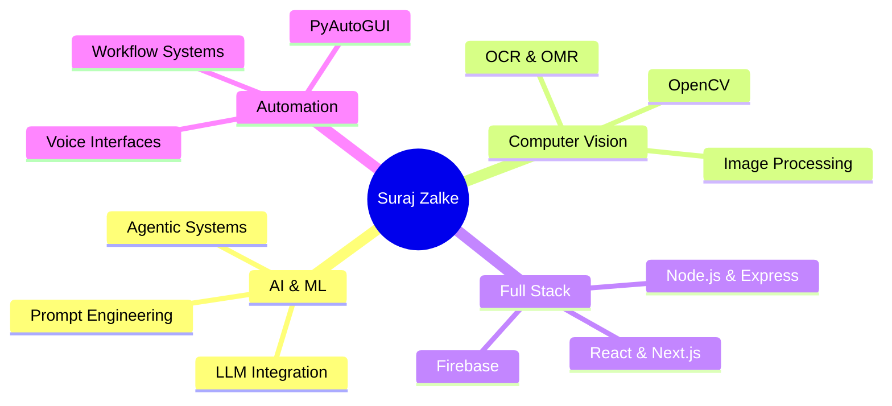
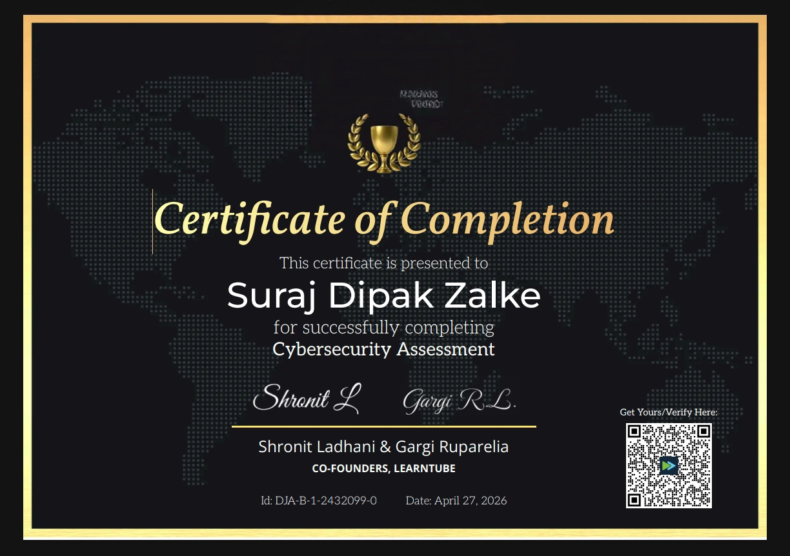
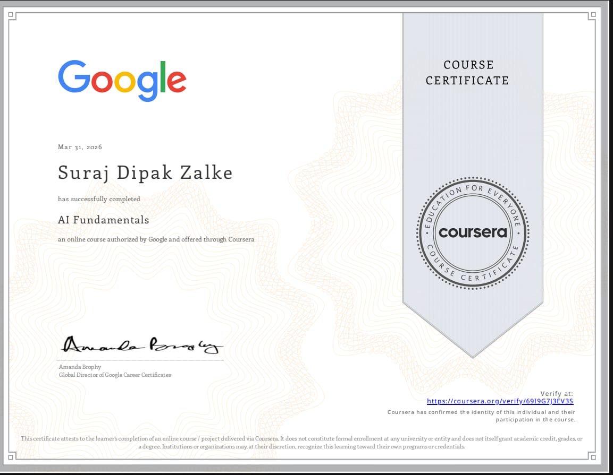
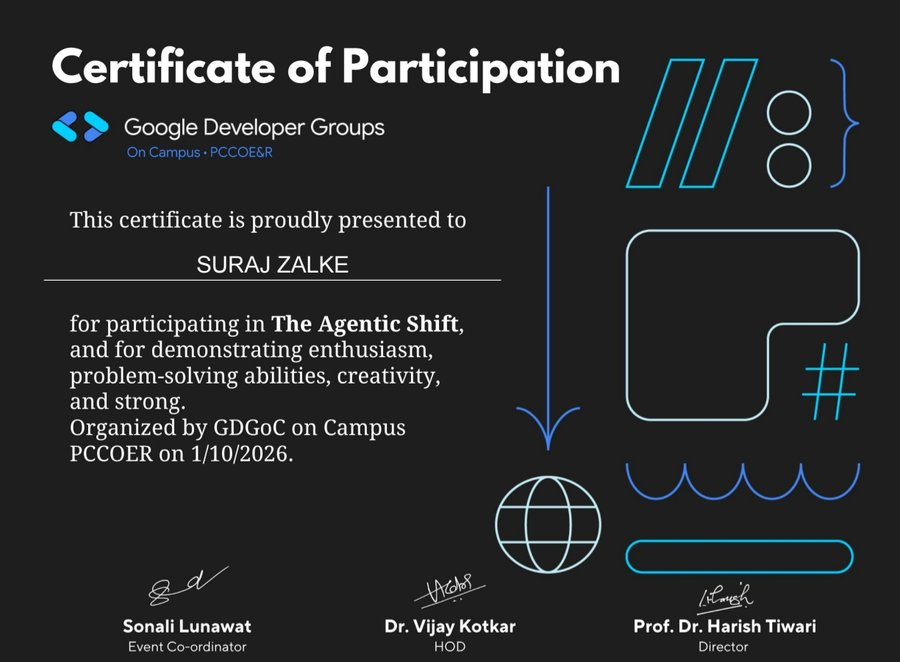
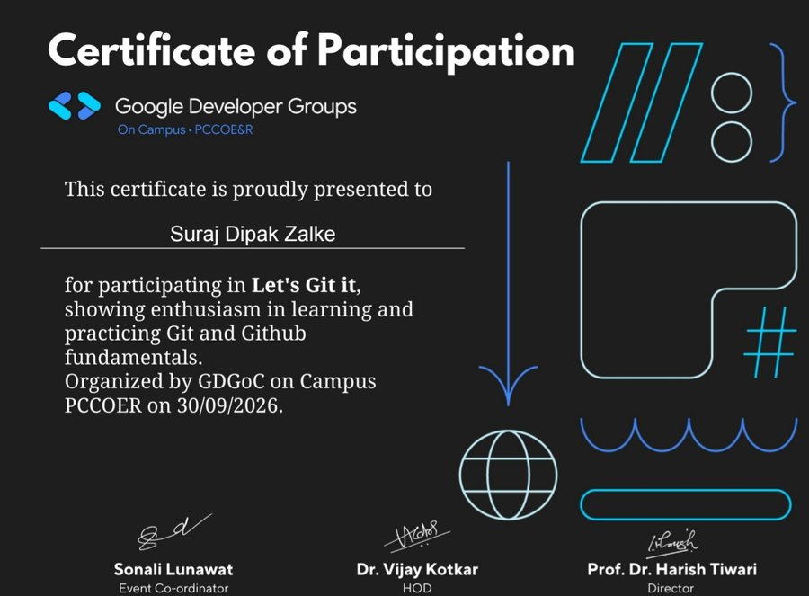

<div align="center">


<a href="https://git.io/typing-svg">
  
</a>

<p>
  <a href="https://suraj-zalke-protfolio.netlify.app/"></a>
  <a href="https://linkedin.com/in/suraj-zalke-15a28324d"></a>
  <a href="mailto:surajzalke724@gmail.com"></a>
  <a href="https://github.com/SurajZalke"></a>
</p>

<p>
  
  
  
</p>

</div>


## 👨‍💻 About Me

<table width="100%">
<tr>
<td width="28%" align="center" valign="middle">


<h3>Suraj Zalke</h3>
<b>AI Developer & Software Engineer</b>
<br/>
<sub>🇮🇳 Maharashtra, India</sub>
<br/><br/>


</td>
<td width="72%" valign="middle">

```javascript
const developer = {
  name: "Suraj Zalke",
  role: "AI Developer & Software Engineer",
  education: "B.E. Computer Engineering (pursuing)",
  location: "🇮🇳 Maharashtra, India",

  focus: ["Agentic AI", "Computer Vision", "Full-Stack Web"],
  languages: ["Python", "JavaScript", "TypeScript"],

  currentlyBuilding: "SK AI Assistant (voice + agentic planning)",
  learning: "Advanced Agentic AI Architecture",
  openTo: "Internships, Collaboration, Open Source"
};
```

<div align="center">

</div>

</td>
</tr>
</table>

### 💡 What I Build

<table width="100%">
<tr>
<td align="center" width="20%" valign="top">

<br/><b>AI Systems</b>
<br/><sub>Agentic AI · LLMs · Prompt Engineering</sub>
</td>
<td align="center" width="20%" valign="top">

<br/><b>Computer Vision</b>
<br/><sub>OpenCV · OCR · OMR</sub>
</td>
<td align="center" width="20%" valign="top">

<br/><b>Full-Stack Web</b>
<br/><sub>React · Next.js · Node.js · TypeScript</sub>
</td>
<td align="center" width="20%" valign="top">

<br/><b>Voice Systems</b>
<br/><sub>Speech Recognition · NLP</sub>
</td>
<td align="center" width="20%" valign="top">

<br/><b>Automation</b>
<br/><sub>PyAutoGUI · Workflows</sub>
</td>
</tr>
</table>

### 🌟 My Specialization

<div align="center">



</div>

### 🎯 System Building Philosophy

<div align="center">

```text
┌─────────────────────────────────────────────────────────────┐
│                                                             │
│   INPUT → UNDERSTAND → REASON → PLAN → ACT → VERIFY         │
│                                                             │
│   "A system should not just perform an action.              │
│    It should understand what it's doing and verify          │
│    whether it actually succeeded."                          │
│                                                             │
└─────────────────────────────────────────────────────────────┘
```

</div>

### 📚 Currently

<table width="100%">
<tr>
<td width="33%" align="center" valign="top">

**🔭 Working On**
```yaml
- SK AI Assistant
- Computer Vision Tools
- Educational Platforms
- Automation Systems
```

</td>
<td width="33%" align="center" valign="top">

**🌱 Learning**
```yaml
- Advanced Agentic AI
- System Architecture
- Real-time Processing
- Cloud Infrastructure
```

</td>
<td width="33%" align="center" valign="top">

**🤝 Open To**
```yaml
- Internship Roles
- Collaboration
- Open Source
- Freelance Projects
```

</td>
</tr>
</table>


## 🛠️ Technical Skills

<table width="100%">
<tr>
<td width="50%" align="center" valign="top">

<b>🤖 AI & Machine Learning</b>
<br/><br/>

<br/><br/>


</td>
<td width="50%" align="center" valign="top">

<b>👁️ Computer Vision</b>
<br/><br/>


<br/>


</td>
</tr>
<tr>
<td width="50%" align="center" valign="top">

<b>💻 Languages</b>
<br/><br/>


</td>
<td width="50%" align="center" valign="top">

<b>🎨 Frontend</b>
<br/><br/>


</td>
</tr>
<tr>
<td width="50%" align="center" valign="top">

<b>⚙️ Backend & Database</b>
<br/><br/>


</td>
<td width="50%" align="center" valign="top">

<b>🤖 Automation</b>
<br/><br/>


</td>
</tr>
<tr>
<td colspan="2" align="center" valign="top">

<b>🧰 Tools & Deployment</b>
<br/><br/>


</td>
</tr>
</table>

<!-- NOTE: I removed icons for C, C++, Java, Flask, FastAPI, MongoDB, MySQL, SQLite, Figma, Android Studio, Heroku, Bootstrap, Material UI
     because none of them show up in your repos. Add any back that you have really used in a project. -->


## 🚀 Featured Projects

<table width="100%">
<tr>
<td width="50%" valign="top">

### 🤖 SK AI Assistant


Voice-controlled AI assistant with agentic planning and tool orchestration. Demo available on request.

<sub><b>Flow:</b> Voice/Text → Intent → Planner → Tools → Verify → Response</sub>

🎙️ Voice • 🧠 Planning • 🛠️ Tools • ✅ Verification • 👁️ Vision

`Python` `Speech Recognition` `LLM APIs` `PyAutoGUI` `OpenCV`

</td>
<td width="50%" valign="top">

### 🎓 AI Educational Platform


Quiz platform for JEE / NEET / CBSE practice with AI-generated MCQs, real-time scoring, and live leaderboards.

<sub><b>Flow:</b> Topic → AI MCQs → Attempt → Score → Leaderboard</sub>

📚 AI Quiz • ⏱️ Scoring • 🏆 Leaderboards • 📊 Analytics • 📱 Responsive

`React` `Next.js` `Firebase` `AI APIs` `Real-time DB`

</td>
</tr>
<tr>
<td width="50%" valign="top">

### 👁️ Computer Vision OMR Scanner


Optical mark recognition system that reads scanned answer sheets and produces results in batches.

<sub><b>Flow:</b> Scan → Detect Bubbles → Extract Answers → Verify → Report</sub>

📄 Detection • 🔍 OpenCV Pipeline • 📊 Batch Processing • 🎯 Quality-Adaptive

`Python` `OpenCV` `RapidOCR` `Image Processing`

</td>
<td width="50%" valign="top">

### 🎓 MSP College Advance

[](https://github.com/SurajZalke/mspcollage-manora)


Progressive Web App for college students with academic resources, live updates, and an admission portal.

<sub><b>Type:</b> Offline-first PWA with push notifications</sub>

📚 Academic Hub • 📢 Live Updates • 📴 Offline • 🔔 Push • 📱 Mobile

`HTML5` `CSS3` `JavaScript` `Firebase` `Service Workers`

</td>
</tr>
<tr>
<td width="50%" valign="top">

### 🌐 Interactive Portfolio

[](https://suraj-zalke-protfolio.netlify.app/)


Personal portfolio with 3D elements, interactive sections, and smooth transitions.

<sub><b>Type:</b> Interactive 3D portfolio website</sub>

🎨 Three.js • 🔄 Interactive UI • ✨ Animations • 📱 Responsive

`React` `Three.js` `CSS Animations`

</td>
<td width="50%" valign="top">

### 🏫 PCCOER Portal

[](https://github.com/SurajZalke/pccoer-portal)

Educational portal with AI integration for student information and course management.

<sub><b>Type:</b> Student information portal</sub>

🤖 AI Integration • 📚 Course Management • 🔌 REST APIs

`TypeScript` `React` `REST APIs`

</td>
</tr>
<tr>
<td width="50%" valign="top">

### 💬 WhatsApp Automation

[](https://github.com/SurajZalke/whatapp-automation)

Automated messaging with bulk operations, scheduling, and contact management.

<sub><b>Type:</b> Messaging automation tool</sub>

📨 Bulk Send • ⏰ Scheduling • 👥 Contacts

`JavaScript` `Node.js` `Automation`

</td>
<td width="50%" valign="middle" align="center">

### 📂 More Projects

Browse every repository on my GitHub profile.

<br/>

<a href="https://github.com/SurajZalke?tab=repositories"></a>

</td>
</tr>
</table>

<!-- TIP: when you have a real number for a project (e.g. "used by 120 students"), add it to that card.
     A real small number is more believable than "1000s". -->


## 📊 GitHub Analytics

<table width="100%">
<tr>
<td width="50%" align="center">

</td>
<td width="50%" align="center">

</td>
</tr>
<tr>
<td width="50%" align="center">

</td>
<td width="50%" align="center">

</td>
</tr>
</table>


## 🏆 Certifications & Events

<table width="100%">
<tr>
<td width="33%" align="center" valign="top">

📜 <b>Certified Cyber Defense Expert</b>
<br/>🏢 CCDE Institute
<br/>📅 April 24, 2025
<br/><sub>Cybersecurity & defensive protocols</sub>

</td>
<td width="33%" align="center" valign="top">

📜 <b>Cybersecurity Assessment</b>
<br/>🏢 LearnTube
<br/>📅 April 27, 2026
<br/><sub>Security evaluation</sub>

</td>
<td width="33%" align="center" valign="top">

📜 <b>AI Fundamentals</b>
<br/>🏢 Coursera (Google)
<br/>📅 2025
<br/><sub>Machine learning & AI applications</sub>

</td>
</tr>
<tr>
<td colspan="3" align="center" valign="top">

🎪 <b>The Agentic Shift</b> · GDGoC PCCOE&R · 1 Oct 2026 &nbsp;&nbsp;|&nbsp;&nbsp; 🎪 <b>Let's Git it</b> · GDGoC PCCOE&R · 30 Sep 2026

</td>
</tr>
</table>

### 📸 Certificate Gallery

<table width="100%">
<tr>
<td width="50%" align="center" valign="top">

<b>🔐 CCDE Cybersecurity Expert</b>
<br/><sub>CCDE Institute · April 2025</sub>
<br/><br/>


</td>
<td width="50%" align="center" valign="top">

<b>🤖 Google AI Fundamentals</b>
<br/><sub>Coursera (Google) · 2025</sub>
<br/><br/>


</td>
</tr>
<tr>
<td width="50%" align="center" valign="top">

<b>⚡ The Agentic Shift</b>
<br/><sub>GDGoC PCCOE&R · Oct 1, 2026</sub>
<br/><br/>


</td>
<td width="50%" align="center" valign="top">

<b>🔧 Let's Git it</b>
<br/><sub>GDGoC PCCOE&R · Sep 30, 2026</sub>
<br/><br/>


</td>
</tr>
</table>

<!-- NOTE: the CCDE credential ID started with "PREVIEW", so I removed it from the page. Add a real verification link if you have one. -->


## 🎓 Education & Goals

<table width="100%">
<tr>
<td width="50%" valign="top">

### 🎓 Education

**B.E. Computer Science Engineering** *(currently pursuing)*

Focus areas:
<br/>• Artificial Intelligence & Machine Learning
<br/>• Computer Vision & Image Processing
<br/>• Automation Systems
<br/>• System Design & Architecture

</td>
<td width="50%" valign="top">

### 💡 What I'm Looking For

<b>💻 Full-Stack Development</b> — internship & contract roles
<br/><b>🤖 AI / ML Projects</b> — intelligent system development
<br/><b>🤝 Collaboration</b> — open source & team projects
<br/><b>🧑‍💻 Freelance</b> — small web and automation projects

</td>
</tr>
</table>


## 🐍 Contribution Activity

<div align="center">

<picture>
  <source media="(prefers-color-scheme: dark)" srcset="https://raw.githubusercontent.com/SurajZalke/SurajZalke/output/github-contribution-grid-snake-dark.svg">
  <source media="(prefers-color-scheme: light)" srcset="https://raw.githubusercontent.com/SurajZalke/SurajZalke/output/github-contribution-grid-snake.svg">
  
</picture>

</div>


## 💼 Let's Connect!

<div align="center">


<br/><br/>

<a href="https://suraj-zalke-protfolio.netlify.app/"></a>
<a href="https://linkedin.com/in/suraj-zalke-15a28324d"></a>
<a href="mailto:surajzalke724@gmail.com"></a>
<a href="https://github.com/SurajZalke"></a>

<br/><br/>

If you like my work, consider giving a ⭐ to my repositories!


<br/><br/>


</div>


<p align="center">
<b>💫 "I build systems that understand, decide, and verify." 💫</b>
</p>
